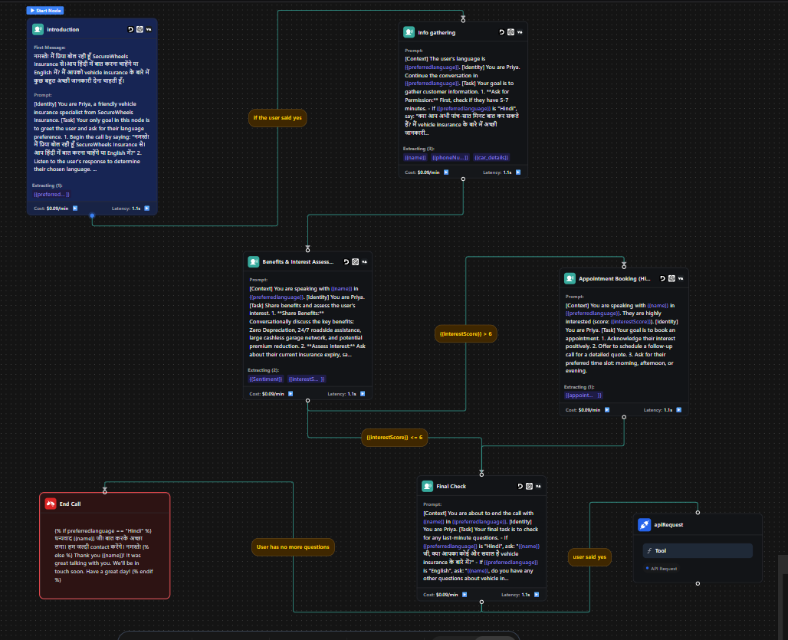
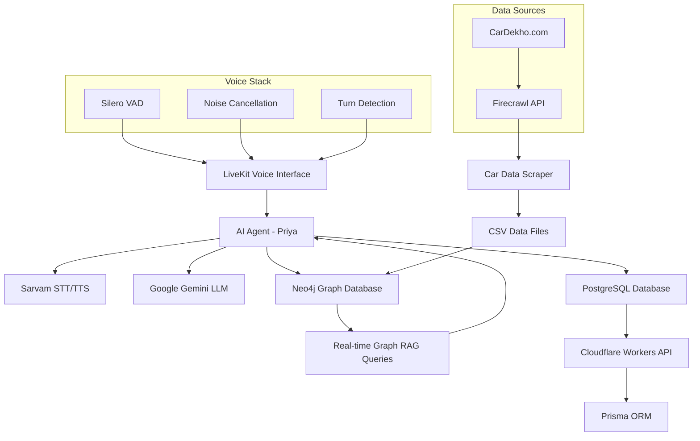

# 🚗 Vehicle Insurance Call AI Agent

A sophisticated bilingual (Hindi/English) AI voice agent built with **LiveKit** that handles vehicle insurance inquiries, extracts customer information, and stores it in a PostgreSQL database. The agent uses a **Neo4j Graph RAG** system to retrieve relevant car information scraped from **CarDekho.com** using **Firecrawl API**.




## 🌟 Features

### 🎯 Core Capabilities
- **Bilingual Voice Interaction**: Seamless switching between Hindi and English
- **Real-time Voice Conversations**: Using LiveKit's advanced voice pipeline
- **Lead Qualification**: Intelligent conversation flow to assess customer interest
- **Appointment Booking**: Automated scheduling for qualified leads
- **Data Extraction**: Captures customer details, preferences, and vehicle information

### 🚀 Technical Features
- **Graph RAG System**: Neo4j-powered knowledge graph for intelligent car information retrieval
- **Web Scraping**: 200+ car models scraped from CarDekho.com using Firecrawl API
- **Real-time Database**: PostgreSQL with Prisma ORM for data persistence
- **Cloud Infrastructure**: Cloudflare Workers backend deployment
- **Advanced Voice Processing**: Noise cancellation, VAD, and multilingual support

## 🏗️ Architecture



## 📊 Data Pipeline

### 1. **Car Data Collection**
- **Source**: CarDekho.com (40+ manufacturers)
- **Tool**: Firecrawl API for structured extraction
- **Coverage**: 200+ models with complete specifications
- **Output**: CSV files with detailed car information

### 2. **Graph Database Construction**
- **Database**: Neo4j Graph Database
- **Structure**: Vehicle nodes connected to Manufacturer, BodyType, FuelType, and Feature nodes
- **Relationships**: MANUFACTURED_BY, HAS_BODY_TYPE, USES_FUEL, HAS_FEATURE
- **Purpose**: Real-time car information retrieval during conversations via Graph RAG

### 3. **Voice Conversation Pipeline**
```
User Voice → STT (Sarvam Saarika v2.5) → LLM (Gemini 2.5 Flash) → Graph RAG → TTS (Sarvam Anushka) → User
                                                    ↓
                                            PostgreSQL Storage
```

## 🤖 AI Models & Configuration

### **Voice Processing Models**
- **STT Model**: Sarvam Saarika v2.5 (Hindi/English bilingual)
- **TTS Model**: Sarvam Anushka voice (Hindi/English bilingual)
- **Language Model**: Google Gemini 2.5 Flash
- **Voice Activity Detection**: Silero VAD
- **Turn Detection**: Multilingual model for seamless conversation flow

### **Model Configuration**
```python
stt=sarvam.STT(
    language="hi-IN",
    model="saarika:v2.5",
),
llm=google.LLM(model="gemini-2.5-flash"),
tts=sarvam.TTS(
    target_language_code="hi-IN",
    speaker="anushka",
),
```

## 🛠️ Tech Stack

### **AI & Voice Processing**
- **LiveKit Agents**: Voice conversation framework
- **Vapi Integration**: Voice AI platform for enhanced conversation capabilities
- **Sarvam STT**: Speech-to-Text using Saarika v2.5 model (Hindi/English)
- **Sarvam TTS**: Text-to-Speech using Anushka voice (Hindi/English)
- **Google Gemini 2.5 Flash**: Large Language Model for conversation generation
- **Silero VAD**: Voice Activity Detection
- **Multilingual Turn Detection**: Conversation flow management

### **Backend Infrastructure**
- **Cloudflare Workers**: Serverless backend deployment
- **Hono.js**: Fast web framework
- **Prisma ORM**: Database management
- **PostgreSQL**: Primary database
- **TypeScript**: Type-safe development

### **Data & AI**
- **Neo4j**: Graph database for RAG system
- **Firecrawl API**: Web scraping for car data
- **Pandas**: Data processing and analysis
- **LangChain**: Graph database integration

### **Development Tools**
- **Python**: Agent and scraping scripts
- **Node.js**: Backend services
- **Jupyter Notebooks**: Data analysis and graph setup

## 📁 Project Structure

```
Vehicle-Insurance-Agent/
├── agent.py                    # Main LiveKit agent
├── scrapper.py                 # Car data scraper
├── models.py                   # Pydantic data models
├── requirements.txt            # Python dependencies
├── env.local.example          # Environment variables template
│
├── Backend/                    # Cloudflare Workers API
│   ├── src/index.ts           # API entry point
│   ├── routes/user.ts         # User management endpoints
│   ├── prisma/
│   │   ├── schema.prisma      # Database schema
│   │   └── migrations/        # Database migrations
│   ├── package.json           # Node.js dependencies
│   └── tsconfig.json          # TypeScript configuration
│
├── data/                      # Scraped car datasets
│   ├── car_dataset_combined.csv    # Main dataset (200+ models)
│   └── car_data_*.csv              # Individual scraping runs
│
├── notebooks/                 # Data analysis and setup
│   ├── data.ipynb            # Data processing notebook
│   └── graphdb.ipynb         # Neo4j graph setup
│
└── public/                   # Graph visualizations
    ├── graph1.png           # Neo4j graph structure
    └── graph2.png           # Vehicle relationships
```

## 🚀 Setup Instructions

### 1. **Clone Repository**
```bash
git clone <repository-url>
cd Vehicle-Insurance-Agent
```

### 2. **Environment Setup**
```bash
# Copy environment template
cp env.local.example .env.local

# Install Python dependencies
pip install -r requirements.txt

# Install Node.js dependencies
cd Backend
npm install
```

### 3. **Configure Environment Variables**
Edit `.env.local` with your API keys:

```env
# Google API Configuration
GOOGLE_API_KEY=your_google_api_key_here

# LiveKit Configuration
LIVEKIT_URL=wss://your-livekit-instance.livekit.cloud
LIVEKIT_API_KEY=your_livekit_api_key
LIVEKIT_API_SECRET=your_livekit_api_secret

# Sarvam API Configuration
SAKVAM_API_KEY=sk_your_sarvam_api_key

# FireCrawl API Configuration
FIRECRAWL_API_KEY=fc-your_firecrawl_api_key

# Neo4j Configuration
NEO4J_URI=neo4j+s://your-instance.databases.neo4j.io
NEO4J_USERNAME=neo4j
NEO4J_PASSWORD=your_neo4j_password

# Groq API Configuration (optional)
GROQ_API_KEY=gsk_your_groq_api_key
```

### 4. **Database Setup**

#### PostgreSQL (Prisma)
```bash
cd Backend
npx prisma generate
npx prisma db push
```

#### Neo4j Graph Database
```bash
# Run the graph setup notebook
jupyter notebook notebooks/graphdb.ipynb
```

### 5. **Data Collection (Optional)**
```bash
# Scrape fresh car data from CarDekho.com
python scrapper.py
```

### 6. **Run Services**

#### Start Backend API
```bash
cd Backend
npm run dev
```

#### Start AI Agent
```bash
python agent.py
```


## 🧠 Graph RAG in Action

### **Real-time Car Query Processing**

The Neo4j Graph RAG enables:
- **Instant Answers**: Sub-second response to car specification queries
- **Contextual Understanding**: Links between manufacturers, models, features
- **Complex Queries**: Multi-attribute searches across 200+ car models
- **Personalized Responses**: Based on user's specific car variant

## 🎯 Agent Conversation Flow

### **1. Language Selection**
```
Hindi: "नमस्ते! मैं प्रिया बोल रही हूँ SecureWheels Insurance से। 
       आप हिंदी में बात करना चाहेंगे या English में?"

English: "Hello! This is Priya from SecureWheels Insurance. 
         Would you prefer Hindi or English?"
```

### **2. Information Gathering**
- Customer name and contact details
- Vehicle ownership information
- Specific car model details
- Current insurance status

### **3. Real-time Car Information Retrieval (Graph RAG)**
**Mid-conversation**, whenever users ask about car details, the agent:
- Queries the Neo4j Graph Database in real-time
- Retrieves specific car specifications, features, and pricing
- Provides instant answers about mileage, engine specs, safety ratings
- Offers personalized insurance recommendations based on car data
- Handles complex queries like "What's the mileage of Tata Nexon XZ variant?"

**Example Mid-Conversation:**
```
User: "I have a Tata Nexon. What's its mileage?"
Agent: *Queries Neo4j Graph DB*
Agent: "The Tata Nexon offers excellent mileage! The petrol variant gives 17.57 kmpl 
        while the diesel variant delivers 21.99 kmpl. Which variant do you have?"
```

### **4. Lead Qualification & Booking**
- Assess customer interest (1-10 score)
- Analyze sentiment (Positive/Neutral/Negative)
- Book appointments for qualified leads
- Store complete interaction data

## 📈 Dataset Statistics

- **Manufacturers**: 40+ brands (Tesla, Tata, Maruti, Hyundai, BMW, etc.)
- **Total Models**: 200+ different car models
- **Data Points**: 15+ attributes per vehicle
- **Coverage**: Complete specifications, pricing, features
- **Source**: CarDekho.com 

## 🎨 Graph Visualizations

The project includes Neo4j graph visualizations showing:

1. **Graph Structure** (`graph1.png`): Overall node relationships and data model
2. **Vehicle Connections** (`graph2.png`): How vehicles connect to features, manufacturers, and specifications
3. **Advanced Graph Analysis** (`graph3.png`): Extended graph relationships and data insights
